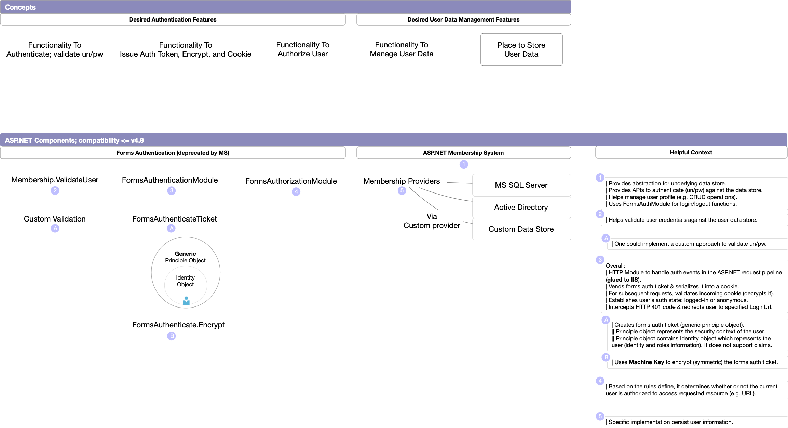
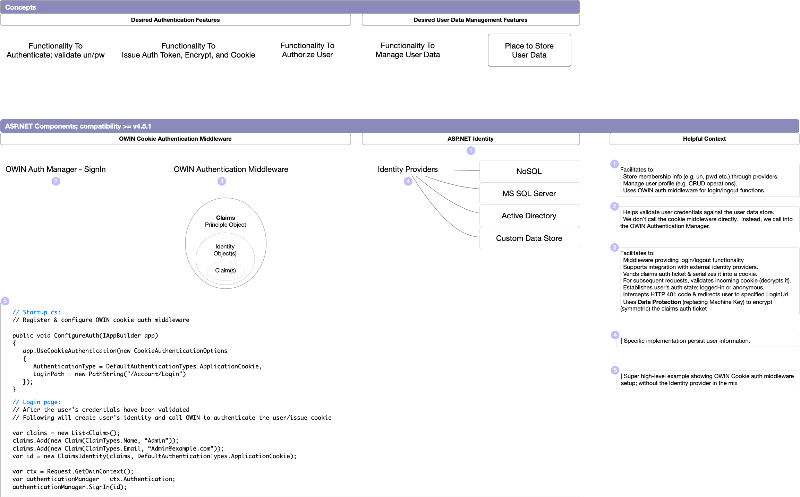
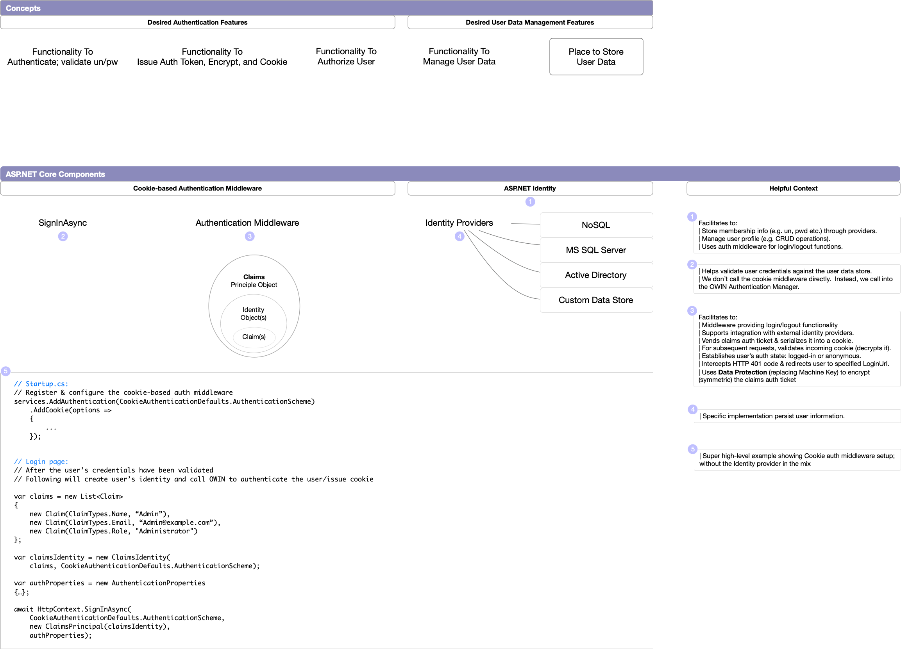

## Summary

Across the ASP.NET frameworks (1.x-4.x/Core), the Forms Auth functionality has evolved. This document takes a minimalist approach and introduces the essential components needed for high-level understanding of the forms auth differences across the ASP.NET frameworks. It will cover 1/ ASP.NET Forms Auth, 2/ OWIN Cookie-based Auth, and 3/ ASP.NET Core cookie-based auth respectively.  Also, within the context of each ASP.NET evolution, we will review the specific ASP.NET components that drives the forms auth.

> This document is meant to be a quick refresher or an intro to the FormAuth components that the reader can do the deep dives as needed.

> We expect this document to continue to evolve through the community's FAQs/feedback/contributions.

<details>
    <summary>Helpful Links</summary>

- [ASP.NET Membership/Identity/Others, historical context](https://docs.microsoft.com/en-us/aspnet/identity/overview/getting-started/introduction-to-aspnet-identity)
  
</details>

<details>
  <summary>Helpful Terms</summary>

- Auth Cookie
  - Its a text files with small pieces of data.
  - Its a container for <em>forms authentication ticket</em>. With each client request, the browser passes the cookie back to the backend server.  
  - On the backend server, cookie is used by the forms authentication to identify an authenticated user.

- Forms Auth Ticket (Cookie content)
  - Its used to tell the ASP.NET application who you are (user's Identity).  
  - Its content is encrypted, serialized, and placed into the cookie.
  - Example below [Source](https://docs.microsoft.com/en-us/dotnet/api/system.web.security.formsauthenticationticket?view=netframework-4.8)

    ```csharp
    FormsAuthenticationTicket ticket = new FormsAuthenticationTicket(1,
        username,
        DateTime.Now,
        DateTime.Now.AddMinutes(30),
        isPersistent,
        userData,
        FormsAuthentication.FormsCookiePath);

    // Encrypt the ticket.
    string encTicket = FormsAuthentication.Encrypt(ticket);

    // Create the cookie.
    Response.Cookies.Add(new HttpCookie(FormsAuthentication.FormsCookieName, encTicket));
    ```

- OWIN (Open Web Interface for .NET)
  - It defines an abstraction for communication (via middleware) between the .NET web servers and the web applications. Prior to OWIN, the ASP.NET was designed on top of IIS, and Web applications could not easily be run on another Web server.

- Katana
  - Microsoft's open source project that uses OWIN's specifications.
  - Helps build and hosting OWIN-based web apps; eliminates the dependency on IIS for hosting.

</details>

<details>
    <summary> 1/ ASP.NET - Membership & Forms Auth</summary>

- Introduced ASP.NET Membership; an abstraction (interface) to manage the user data store (e.g. CRUD User tables in the MS SQL Server).
- Added MembershipProvider (concrete implementation) to manage user profile, validate user credentials, and more.
- Provided HTTP FormsAuthenticationModule that works with the ASP.NET request pipeline (guled to IIS).
- The ASP.NET 2.0 added the ability to manage user roles and store them into the forms auth ticket.



</details>

<details>
    <summary> 2/ ASP.NET - Identity & OWIN Cookie-Based Auth </summary>

- Introduced the concept of ASP.NET Identity.  Its an evolution of the ASP.NET Membership to handle modernized workloads (e.g. integration with external Idp, Two factor auth).
- Provides an OWIN Cookie-based auth middleware:
  - It authenticates the user, issue an auth token and cookie.
  - It uses the Machine Key to encrypt/decrypt the auth token.
  - Uses Data Protection to encrypt/decrypt forms auth ticket.
- In addition to the user's Role information, now we can store user's claims in the token and perform Claims-based authentication.



</details>

<details>
    <summary> 3/ ASP.NET - Identity & Core Cookie-Based Auth </summary>

- Similar to the <em>ASP.NET - Identity & OWIN Cookie-Based Auth</em>, discussed above.
  - Provides a Cookie-based auth middleware which authenticates the user
  - Issues an auth token and cookie.
  - It uses the Machine Key to encrypt/decrypt the auth token.
  - Uses Data Protection to encrypt/decrypt forms auth ticket.
  - In addition to the user's Role information, now we can store user's claims in the token and perform Claims-based authentication.



</details>
